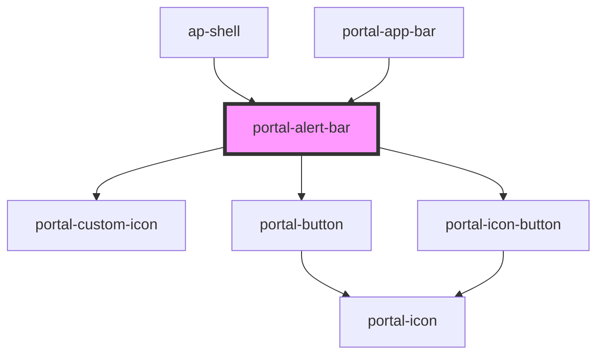

# portal-banner

<!-- Auto Generated Below -->

## Properties

| Property|Attribute| Description| Type| Default|
| ------------------------ | --------------------------- | --------------------------------------------------------- | ------------------------------------------------------------------------------------------------------------------------------------- | ------------- |
| `cancelable`| `cancelable`| The cancelable alert-bar     | `boolean`    | `true`        |
| `endDate`                | `end-date`                  | The end date for trial alert-bar    | `number`     | `0`           |
| `ieonly`                 | `ieonly`   | show only on IE  | `boolean \| undefined`     | `undefined`   |
| `showContactSalesButton` | `show-contact-sales-button` | Show the contact sales button (generally for admins only) | `boolean`                                   | `false`       |
| `status`  | `status` | The status of alert-bar  | `str | `'info'`      |
| `subscriptionType`       | `subscription-type`         | The subscription type of alert-bar                        | `AccountType.Community \| AccountType.Enterprise \| AccountType.Free \| AccountType.Pro \| AccountType.ProTrial \| AccountType.Trial` | `undefined`   |
| `theme`                  | `theme`                     | Theme override to bypass store state                      | `"autoTheme" \| "dark" \| "light"`  | `'autoTheme'` |

## Events

| Event            | Description                                      | Type                               |
| ---------------- | ------------------------------------------------ | ---------------------------------- |
| `alertDismissed` | Trigger a custom event for alert being dismissed | `CustomEvent<AlertDismissedEvent>` |

## Slots

| Slot | Description                        |
| ---- | ---------------------------------- |
|      | Content shown inside the alert bar |

## Dependencies

### Used by

 - [ap-shell](../ap-shell)
 - [portal-app-bar](../portal-app-bar)

### Depends on

- [portal-custom-icon](../portal-custom-icon)
- [portal-button](../portal-button)
- [portal-icon-button](../portal-icon-button)

### Graph

----------------------------------------------

Made with ❤️ by UiPath Apollo Team
